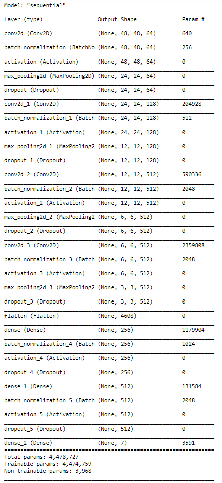
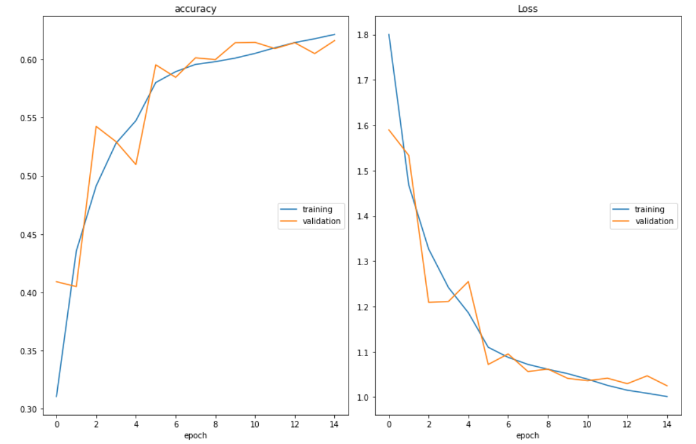
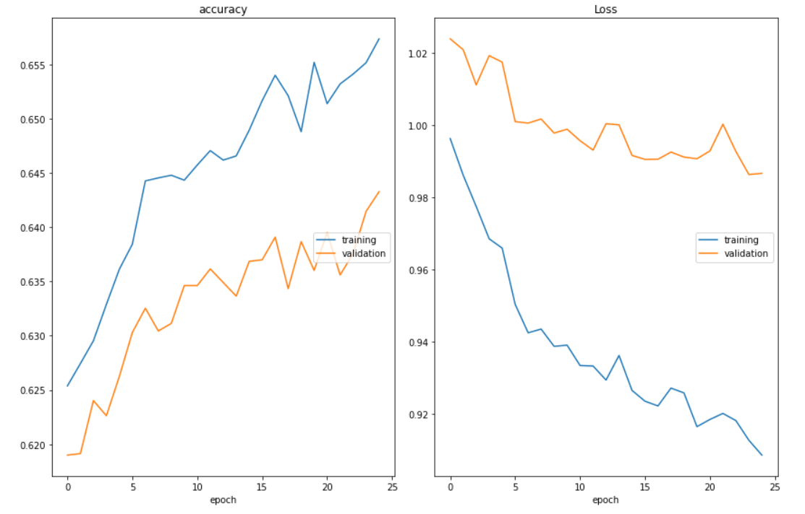
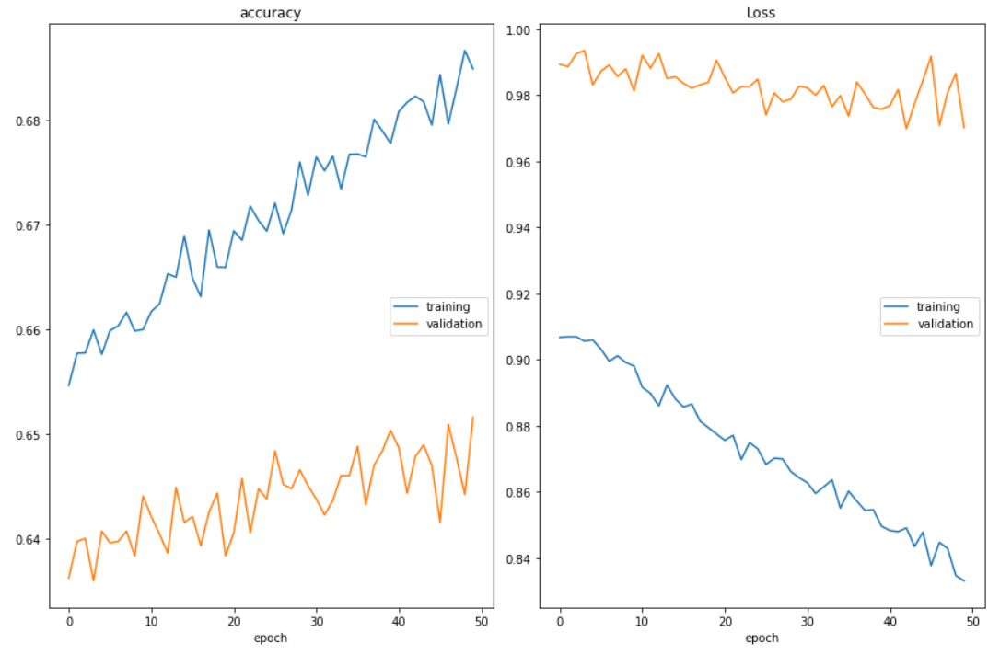

[](https://opensource.org/licenses/MIT)

# Facial-Expression-Recognition-with-CNNs
Facial Expression Recognition with CNNs on TensorFlow-Keras with OpenCV and Python. Flask app was used to get a web-interface to deploy the algorithm.  


Video source: https://www.youtube.com/watch?v=5w3cYtJekpw

Algorithm output: https://youtu.be/ojB1LSCKUpM


Video source: https://www.youtube.com/watch?v=B0ouAnmsO1Y

Algorithm output: https://youtu.be/jzaEGQrXRtA

# Overview

In this project, I built and trained a convolutional neural network (CNN) in Keras from scratch to recognize facial expressions. I have used the 2013 Facial Emotion Recognition Dataset (https://datarepository.wolframcloud.com/resources/FER-2013). The dataset consists of 48x48 pixel grayscale images of faces. The objective is to classify each face based on the emotion shown in the facial expression into one of seven categories (0=Angry, 1=Disgust, 2=Fear, 3=Happy, 4=Sad, 5=Surprise, 6=Neutral). I used OpenCV to automatically detect faces in images and draw bounding boxes around them. Once the model has been trained, saved, and exported the CNN, I use the trained model to a web interface and perform real-time facial expression recognition on video and image data. The video input can be changed to take in webcam by uncommenting one line of code. Real time perfomance depends on the hardware specifications.

# Project Requirements/ Dependencies
TensorFlow-GPU

OpenCV

Seaborn

Matplotlib

Keras

Livelossplot

Flask

# CNN model architecture
<p align="center">
  
</p>

# Pipeline

1) 


# Results
<p align="center">

<em> Accuracy plots for 15 epochs</em>
</p>


<p align="center">

<em> Accuracy plots for 25 epochs</em>
</p>


<p align="center">

<em> Accuracy plots for 50 epochs</em>
</p>


# Command to run code
```
python main.py
```
# Certification 

Coursera certificate for the project: https://coursera.org/share/cb5b1cee88ad5ded6055c0f0c3adeaa4

# Known Issues/Bugs

The Haar Cascades are not the most robust way of identifying faces. Observed a few false face detections at times near a person's neck. A better approach would be to use DLib library for a faster and more accurate face detection. (http://dlib.net/) Would be working on Dlib library for future projects.

The data in the 'Disgust' class can be augmented to get a more generalized model. 

# References
Coursera: https://www.coursera.org/projects/facial-expression-recognition-keras

# Licence
The Repository is Licensed under the MIT License.
```
MIT License

Copyright (c) 2019 Charan Karthikeyan Parthasarathy Vasanthi, Nagireddi Jagadesh Nischal, Sai Manish V

Permission is hereby granted, free of charge, to any person obtaining a copy
of this software and associated documentation files (the "Software"), to deal
in the Software without restriction, including without limitation the rights
to use, copy, modify, merge, publish, distribute, sublicense, and/or sell
copies of the Software, and to permit persons to whom the Software is
furnished to do so, subject to the following conditions:

The above copyright notice and this permission notice shall be included in all
copies or substantial portions of the Software.

THE SOFTWARE IS PROVIDED "AS IS", WITHOUT WARRANTY OF ANY KIND, EXPRESS OR
IMPLIED, INCLUDING BUT NOT LIMITED TO THE WARRANTIES OF MERCHANTABILITY,
FITNESS FOR A PARTICULAR PURPOSE AND NONINFRINGEMENT. IN NO EVENT SHALL THE
AUTHORS OR COPYRIGHT HOLDERS BE LIABLE FOR ANY CLAIM, DAMAGES OR OTHER
LIABILITY, WHETHER IN AN ACTION OF CONTRACT, TORT OR OTHERWISE, ARISING FROM,
OUT OF OR IN CONNECTION WITH THE SOFTWARE OR THE USE OR OTHER DEALINGS IN THE
SOFTWARE.
```
